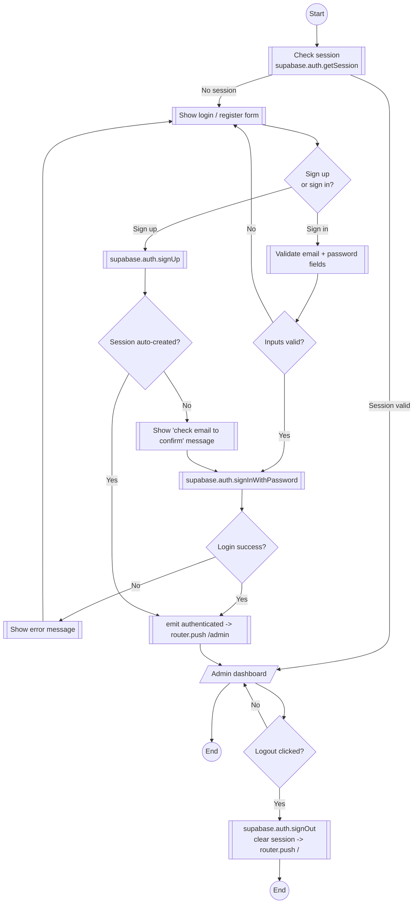
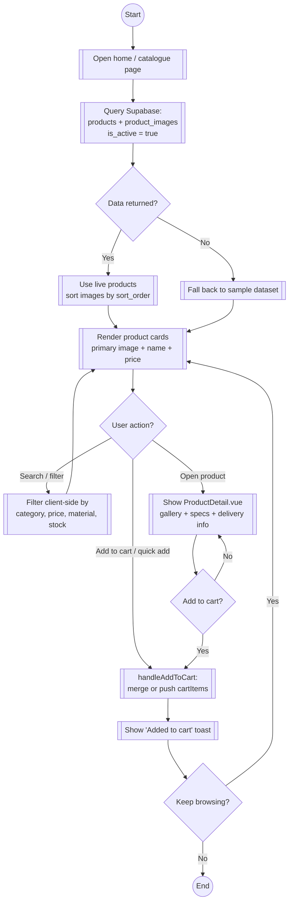

# SAFS Furniture — Flowcharts (Issue #21)

**Scope:** Flowcharts for the four core flows:
1. Auth (register / login / logout)
2. Catalogue browse
3. Cart & checkout
4. Admin product + image management

**Grounded in:** current prototype (`src/App.vue`, `AdminLogin.vue`, `Catalog.vue`, `CartDrawer.vue`, `ProductDetail.vue`, `AdminUpload.vue`) + Supabase Auth/Storage/Postgres.
**Legend:** `(())` start/stop · `[]` process · `{ }` decision (≤ 2 outcomes) · `[/ /]` input/output.

---

## 1. Auth Flowchart



---

## 2. Catalogue Browse Flowchart



---

## 3. Cart & Checkout Flowchart

```mermaid
flowchart TD
    START((Start))
    START --> OPEN[[Open cart drawer]]
    OPEN --> EMPTY{Cart has items?}
    EMPTY -->|No| E1[[Show empty-state message]]
    E1 --> END1((End))
    EMPTY -->|Yes| LIST[[List line items]]
    LIST --> TOTALS[[Compute subtotal]]
    TOTALS --> SHIP{Subtotal > R 15 000?}
    SHIP -->|Yes| FREE[[Shipping = R 0<br/>(Free Delivery)]]
    SHIP -->|No| FEE[[Shipping = R 450]]
    FREE --> TOTAL
    FEE --> TOTAL
    TOTAL[[Grand total incl. VAT]]

    LIST --> MGT{Update quantity<br/>or remove?}
    MGT -->|+ / -| QTY{Qty <= 0?}
    MGT -->|Remove| QTY2[Remove line item]
    QTY -->|Yes| QTY2
    QTY -->|No| LIST
    QTY2 --> LIST

    TOTAL --> PROCEED{Proceed to<br/>secure checkout?}
    PROCEED -->|No| LIST
    PROCEED -->|Yes + current prototype| CLEAR[[Toast 'Checkout initialized'<br/>clear cart + close drawer]]
    CLEAR --> END2((End))

    PROCEED -->|Yes + target flow| CHECK[[Validate addresses + zone + terms]]
    CHECK --> VALID{Valid?}
    VALID -->|No| ERROR[[Show validation errors]]
    ERROR --> LIST
    VALID -->|Yes| INTENT[[Create payment intent at gateway]]
    INTENT --> GATEWAY[[Redirect to hosted payment page<br/>(no card data via platform)]]
    GATEWAY --> PAID{Payment success?}
    PAID -->|No| FAILED[[Return to checkout with error]]
    FAILED --> LIST
    PAID -->|Yes| WEBHOOK[[Signed webhook verified<br/>(HMAC + idempotency)]]
    WEBHOOK --> ORDER[[Insert order + order_items<br/>decrement stock, paid_at = now]]
    ORDER --> EMAIL[[Send confirmation email<br/>with PDF VAT invoice]]
    EMAIL --> CONFIRM[/Order confirmation page<br/>/orders/id/]
    CONFIRM --> END3((End))
```

---

## 4. Admin Product + Image Flowchart

```mermaid
flowchart TD
    START((Start))
    START --> LOGIN[[Admin authenticates]]
    LOGIN --> INV[[fetchInventory: products + product_images]]
    INV --> TAB{Action?}

    TAB -->|Create product| FORM[[Fill form + select/drop images]]
    FORM --> PREVIEW[[Preview images client-side<br/>via FileReader]]
    PREVIEW --> VALIDATE{Proudct name<br/>and price set?}
    VALIDATE -->|No| FORM
    VALIDATE -->|Yes| SLUG[[generateSlug]]
    SLUG --> INSERT[[INSERT products -> select().single()]]
    INSERT --> ID[/newProduct.id/]
    ID --> LOOP{More files?}
    LOOP -->|Yes| UPLOAD[[Upload file to<br/>storage: product-images]]
    UPLOAD --> OK{Upload success?}
    OK -->|No| LOOP
    OK -->|Yes| URL[[getPublicUrl]]
    URL --> PIMG[[INSERT product_images<br/>is_primary: first image<br/>sort_order: index]]
    PIMG --> LOOP
    LOOP -->|No| RESET[[Reset form]]
    RESET --> REFRESH[[fetchInventory + emit product-updated]]
    REFRESH --> END1((End))

    TAB -->|Edit product| LOAD[[Load existing images<br/>(is_primary + sort_order)]]
    LOAD --> EDIT{User action?}
    EDIT -->|Star as primary| PRIMARY[[setPrimaryImage -><br/>UPDATE is_primary + sort_order]]
    EDIT -->|Reorder arrows| MOVE[[moveExistingImage -><br/>persist sort_order]]
    EDIT -->|Upload new images| NIMG[[Upload + insert new product_images<br/>(primary only if none exists)]]
    EDIT -->|Update details| UPD[[UPDATE products]]
    PRIMARY --> SAVE[[Success message + refresh]]
    MOVE --> SAVE
    NIMG --> SAVE
    UPD --> SAVE
    SAVE --> END2((End))

    TAB -->|Delete product| DEL{{Confirm delete?}}
    DEL -->|No| END3((End))
    DEL -->|Yes| DELETE[[DELETE products WHERE id]]
    DELETE --> REMOVE[[Remove from local list]]
    REMOVE --> END4((End))

    TAB -->|Toggle active| TOGGLE[[UPDATE is_active]]
    TOGGLE --> END5((End))
```

---

## Rendering tips

- **GitHub:** renders natively in issues and markdown.
- **VS Code:** "Mermaid Preview" extension.
- **Export:** `npx @mermaid-js/mermaid-cli -i uml/flowcharts.md -o flowcharts.svg`
- **Paste into issue #21:** wrap each diagram in ```mermaid fenced code blocks.
