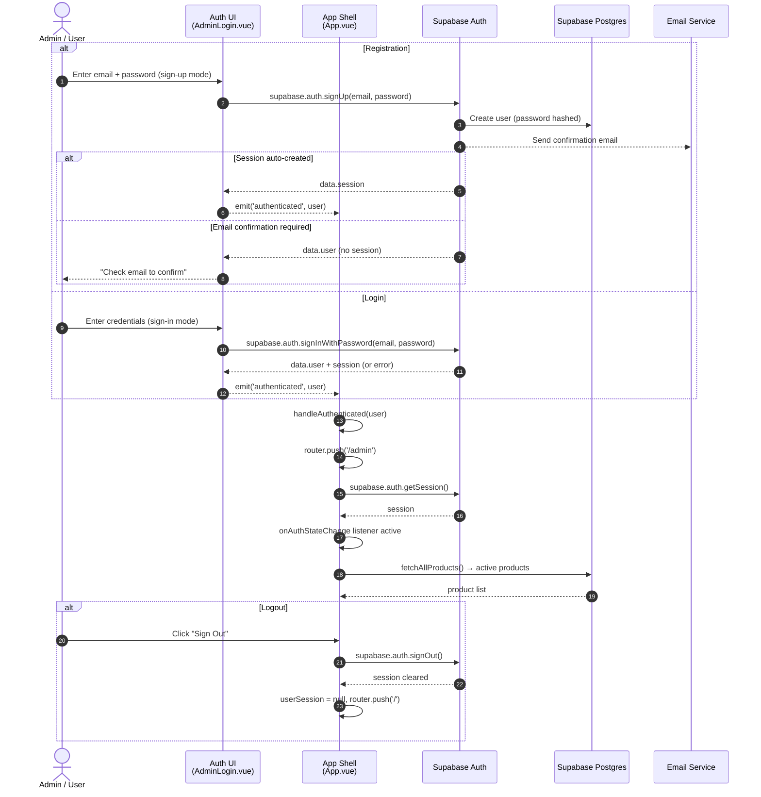
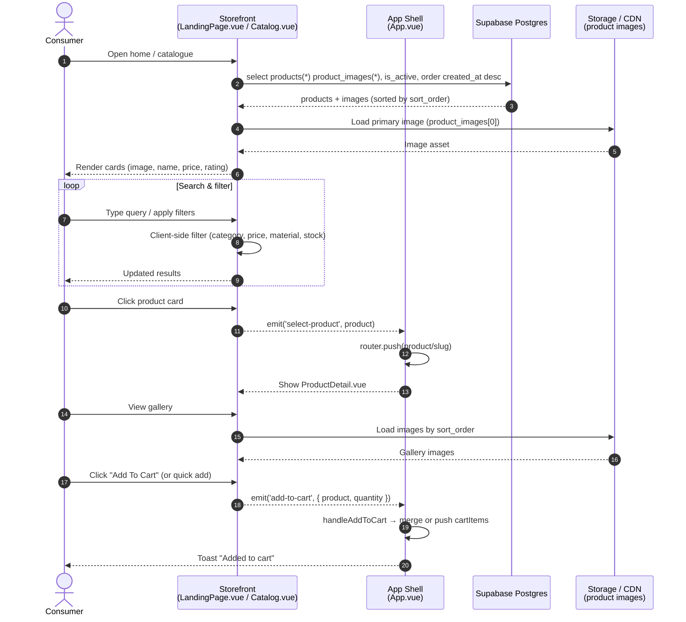
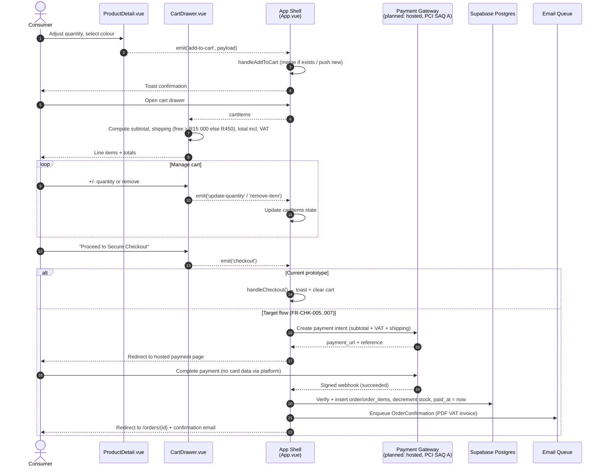
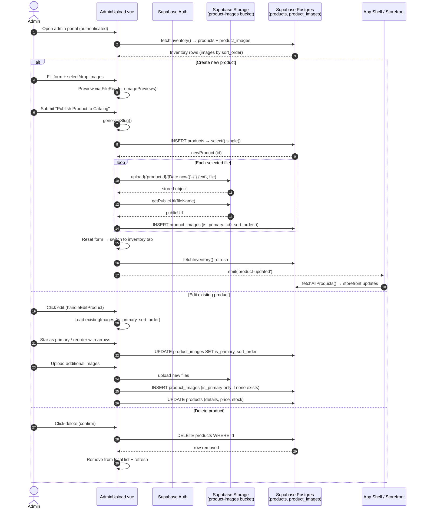

# SAFS Furniture — Sequence Diagrams (Issue #22)

**Scope:** Sequence diagrams for the same four flows as issue #21:
1. Auth (register / login / logout)
2. Catalogue browse & product view
3. Cart & checkout
4. Admin product + image management

**Grounded in:** current prototype implementation (`src/App.vue`, `src/components/AdminLogin.vue`, `Catalog.vue`, `CartDrawer.vue`, `ProductDetail.vue`, `AdminUpload.vue`) with Supabase Auth / Storage / Postgres.

---

## 1. Auth — Registration, Login & Logout



---

## 2. Catalogue Browse & Product View



---

## 3. Cart & Checkout



---

## 4. Admin — Product & Image Management



---

## Rendering tips

- **GitHub:** Mermaid sequence diagrams render natively in issues and markdown.
- **VS Code:** "Mermaid Preview" extension or markdown preview.
- **Export PNG/SVG:** `npx @mermaid-js/mermaid-cli -i uml/sequence-diagrams.md -o sequence-diagrams.svg`
- **Paste into issue #22:** wrap each block in ```mermaid fenced code blocks.