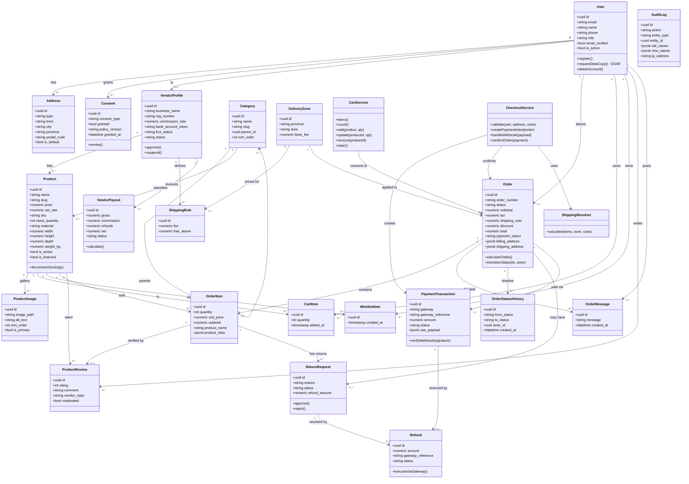
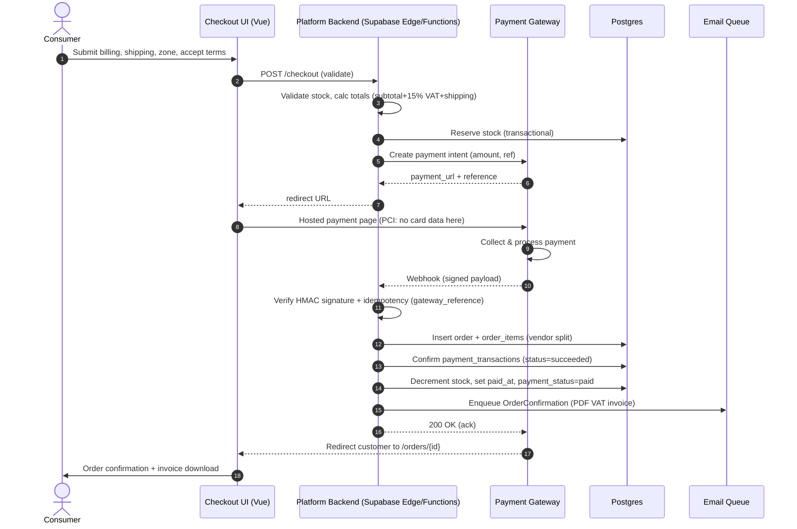
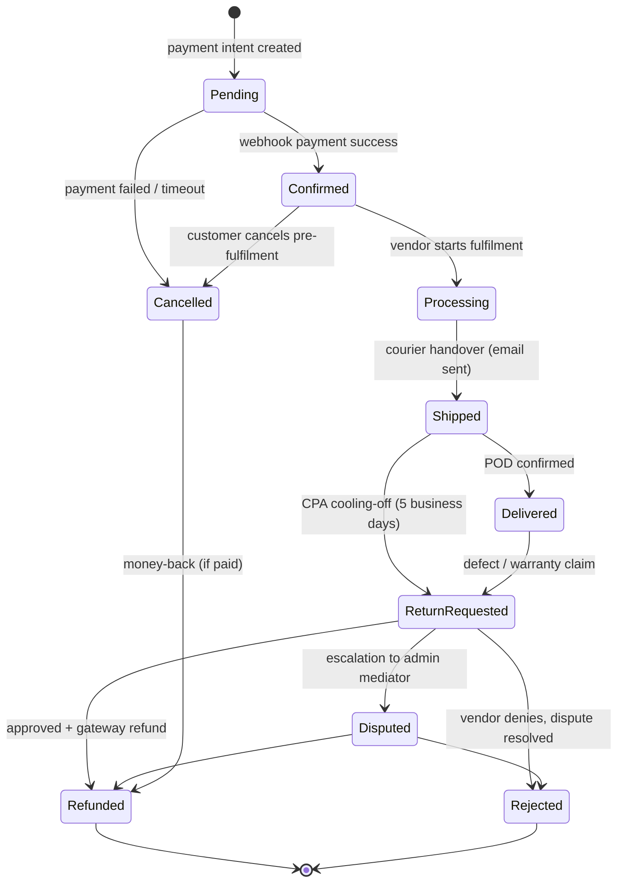

# SAFS Furniture Marketplace — UML Diagrams

**Source:** `vision/requirements.md` v1.0 · Renders on GitHub / VS Code (Mermaid extension) / mermaid-cli
**Contents:** 1) Use Case · 2) Domain Class Diagram · 3) Checkout Sequence · 4) Order State Machine

---

## 1. Use Case Diagram

```mermaid
flowchart TB
    subgraph platform["SAFS Marketplace Platform"]
        direction TB

        subgraph storefront["Storefront"]
            BROWSE["Browse catalogue"]
            SEARCH["Search & filter"]
            VIEW["View product detail<br/>(gallery, specs, CPA info)"]
            CART["Manage multi-vendor cart"]
            WISHLIST["Manage wishlist"]
            CHECKOUT["Checkout & pay"]
            ORDERS["View orders / tracking"]
            RETURN["Request return / refund"]
            REVIEW["Write verified review"]
            CONSENT["Manage consents & POPIA rights<br/>(DSAR, delete account)"]
            SUPPORT["Order messaging"]
        end

        subgraph vendorPortal["Vendor Portal"]
            APPLY["Apply to sell"]
            LISTINGS["Manage listings & primary image"]
            STOCK["Manage stock & pricing"]
            SHIPR["Set shipping rules"]
            FULFIL["Fulfil orders (process/ship)"]
            PAYOUTV["View payouts & statements"]
            REPLY["Reply to reviews"]
            MESSAGING["Communicate on orders"]
        end

        subgraph adminPortal["Admin Portal"]
            APPROVE["Approve / suspend vendors"]
            MODERATE["Moderate listings, reviews, disputes"]
            CATS["Manage categories & featured"]
            ADMINORDERS["Oversee orders & refunds"]
            ADMREV["Manage vendors & commission"]
            LEGAL["Manage legal docs & versions"]
            AUDIT["View audit log"]
        end
    end

    consumer(["Consumer"])
    vendor(["Vendor"])
    admin(["Administrator"])
    gateway["Payment Gateway (system)"]
    email["Email Service (system)"]

    consumer --> BROWSE & SEARCH & VIEW & CART & WISHLIST & CHECKOUT & ORDERS & RETURN & REVIEW & CONSENT & SUPPORT
    vendor --> APPLY
    vendor --> LISTINGS & STOCK & SHIPR & FULFIL & PAYOUTV & REPLY & MESSAGING
    admin --> APPROVE & MODERATE & CATS & ADMINORDERS & ADMREV & LEGAL & AUDIT

    CHECKOUT --> gateway : "hosted payment (PCI SSP)"
    gateway -. webhook .-> CHECKOUT
    ORDERS --> email
    SUPPORT --> email
```

---

## 2. Domain Class Diagram



---

## 3. Checkout Sequence Diagram (payment webhook flow)



---

## 4. Order State Machine



---

## Rendering tips

- **GitHub / GitLab:** Mermaid renders natively in markdown.
- **VS Code:** install "Mermaid Preview" extension; or use the Markdown preview with mermaid support.
- **CLI (PNG/SVG export):** `npx @mermaid-js/mermaid-cli -i vision/erd.md -o erd.svg`
- **draw.io / Lucidchart import:** paste the class diagram or ERD code into the "Insert > Advanced > Mermaid" option if supported; otherwise convert via mermaid.live.
